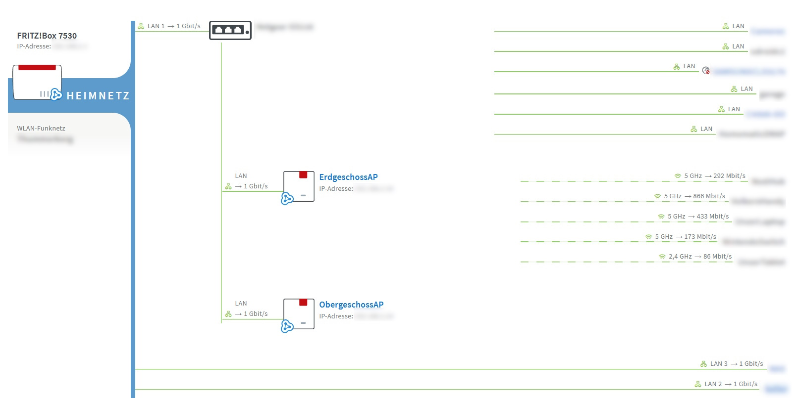

# fritzmesh
Proxy daemon to show the Fritz!Box mesh overview outside of the regular Fritz!Box user interface

Functionalities offered:

 * Extract the Fritz Mesh renderer from the Fritz!Box WebUI
 * Modify some css / js parameters to make the overview appear in fullscreen
 * Cache the modified data locally

## Configuration

Edit `fritzmesh` to your needs:
 * fritzboxUsername: The username of your Fritz!Box
 * fritzboxPassword: Corresponding users password
 * fritzboxHost: Hostname or IP under which the Fritz!Box is reachable
 * fritzMeshPort: The local port of the hosting server under which the fritz mesh overview will be made available 

## Installation

Besides Python 3.11, there are no additionaly dependencies.
To install:
 * Clone or download the project.
 * Install, using `sudo sh ./make_install`

## Usage

After installation, access with a browser of your choice the Mesh Overview UI at `http://<yourddaemonhost>:<fritzMeshPort>`
